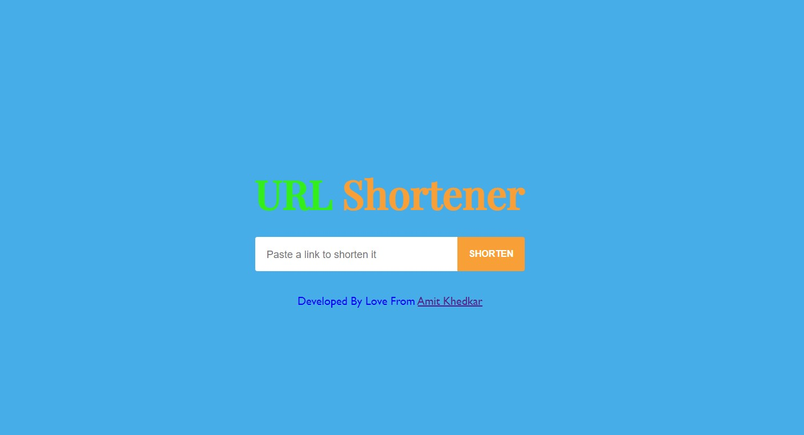

 This is a URL shortening application..
 Paste your URL and the app will give you the shotened form of URL.

## Available Scripts

In the project directory, you can run:

### `npm install`

Instal All dependencies in this project

### `npm start`

Runs the app in the development mode. 
Open [http://localhost:3000](http://localhost:3000) to view it in the browser.

###`link to app`

https://url-shortner-amitk.onrender.com
